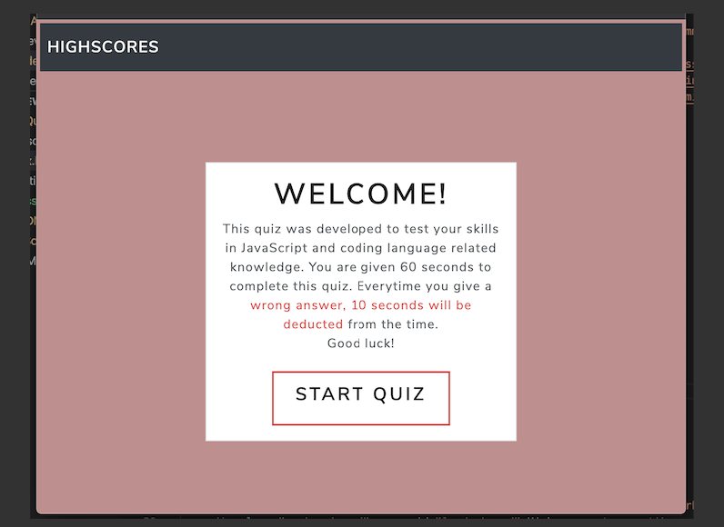

# Vanilla Javascript -- Code Quiz

## Description

A simple javascript knowledge quiz created using mostly vanilla javascipt. There are six different quiz questions. Anything answered incorrectly will result in a time penalty. In the end, user will be able to store score in leaderboard list.

## Installation

* Click on start button to begin quiz.
* Answer questions to move on to the next question.
* Time reduced everytime user answers incorrectly.
* See and record score in leaderboard.

## Preview

## Link

https://seykoplik.github.io/CodeQuiz/

--- 
© 2020 Seychelle Koplik
